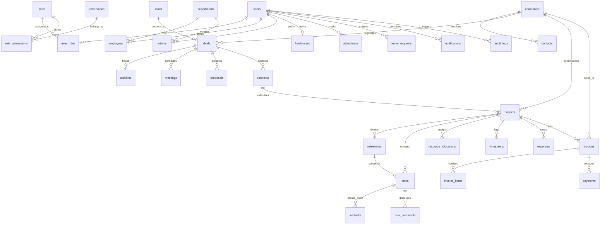

# Kapate OS - Database Schema & ERD Specification

## 1. Overview
The Kapate OS data model is fully normalized to 3NF, utilizing relational integrity constraints, foreign keys with appropriate cascade policies, unique indexes, and audit timestamps across all entities.

---

## 2. Entity Relationship Overview

---

## 3. Entity Definitions

### Identity & RBAC
1. **`users`**: Core user authentication table.
   - `id`: UUID (PK)
   - `email`: VARCHAR(255) UNIQUE INDEX NOT NULL
   - `hashed_password`: VARCHAR(255) NOT NULL
   - `full_name`: VARCHAR(255) NOT NULL
   - `phone`: VARCHAR(50)
   - `avatar_url`: VARCHAR(512)
   - `is_active`: BOOLEAN DEFAULT TRUE
   - `is_verified`: BOOLEAN DEFAULT FALSE
   - `last_login_at`: TIMESTAMP WITH TIME ZONE
   - `created_at`, `updated_at`: TIMESTAMP WITH TIME ZONE NOT NULL

2. **`roles`**: System roles.
   - `id`: INT / UUID (PK)
   - `name`: VARCHAR(50) UNIQUE NOT NULL (`superadmin`, `partner`, `consultant`, `engineer`, `intern`, `freelancer`, `client`)
   - `description`: VARCHAR(255)
   - `is_system`: BOOLEAN DEFAULT TRUE

3. **`permissions`**: Fine-grained access privileges.
   - `id`: INT / UUID (PK)
   - `code`: VARCHAR(100) UNIQUE NOT NULL (e.g. `crm:leads:read`, `finance:invoices:create`)
   - `module`: VARCHAR(50) NOT NULL (`crm`, `workforce`, `delivery`, `finance`, `system`)
   - `description`: VARCHAR(255)

4. **`role_permissions`**: Many-to-many join table between roles and permissions.
5. **`user_roles`**: Many-to-many join table between users and roles.

### CRM & Sales Pipeline
6. **`companies`**: Client organizations.
   - `id`: UUID (PK)
   - `name`: VARCHAR(255) NOT NULL
   - `domain`: VARCHAR(100)
   - `industry`: VARCHAR(100)
   - `website`: VARCHAR(255)
   - `gst_number`: VARCHAR(50)
   - `address`: TEXT
   - `city`: VARCHAR(100)
   - `country`: VARCHAR(100) DEFAULT 'India'

7. **`contacts`**: Individual stakeholders.
   - `id`: UUID (PK)
   - `company_id`: UUID (FK -> companies.id)
   - `name`: VARCHAR(255) NOT NULL
   - `email`: VARCHAR(255) NOT NULL
   - `phone`: VARCHAR(50)
   - `designation`: VARCHAR(100)
   - `is_primary`: BOOLEAN DEFAULT FALSE

8. **`leads`**: Incoming sales inquiries.
   - `id`: UUID (PK)
   - `source`: VARCHAR(50) NOT NULL (`website_form`, `referral`, `outreach`)
   - `company_name`: VARCHAR(255) NOT NULL
   - `contact_name`: VARCHAR(255) NOT NULL
   - `email`: VARCHAR(255) NOT NULL
   - `phone`: VARCHAR(50)
   - `service_interest`: VARCHAR(100)
   - `budget_range`: VARCHAR(100)
   - `brief`: TEXT
   - `status`: VARCHAR(50) DEFAULT 'new' (`new`, `qualified`, `disqualified`, `converted`)
   - `converted_deal_id`: UUID (FK -> deals.id, Nullable)

9. **`deals`**: Commercial opportunities.
   - `id`: UUID (PK)
   - `company_id`: UUID (FK -> companies.id)
   - `primary_contact_id`: UUID (FK -> contacts.id)
   - `lead_id`: UUID (FK -> leads.id, Nullable)
   - `title`: VARCHAR(255) NOT NULL
   - `pipeline_stage`: VARCHAR(50) NOT NULL (`discovery`, `nda_sent`, `proposal_sent`, `negotiation`, `closed_won`, `closed_lost`)
   - `estimated_value`: NUMERIC(14, 2) NOT NULL
   - `currency`: VARCHAR(10) DEFAULT 'INR'
   - `expected_close_date`: DATE
   - `win_probability`: INT DEFAULT 50
   - `owner_user_id`: UUID (FK -> users.id)

10. **`activities`**: CRM audit and interaction trail.
    - `id`: UUID (PK)
    - `entity_type`: VARCHAR(50) NOT NULL (`lead`, `deal`, `company`, `project`)
    - `entity_id`: UUID NOT NULL
    - `activity_type`: VARCHAR(50) NOT NULL (`call`, `email`, `meeting`, `note`, `stage_change`)
    - `notes`: TEXT NOT NULL
    - `created_by_user_id`: UUID (FK -> users.id)

11. **`meetings`**: Scheduled discussions.
    - `id`: UUID (PK)
    - `deal_id`: UUID (FK -> deals.id, Nullable)
    - `project_id`: UUID (FK -> projects.id, Nullable)
    - `title`: VARCHAR(255) NOT NULL
    - `start_time`: TIMESTAMP WITH TIME ZONE NOT NULL
    - `end_time`: TIMESTAMP WITH TIME ZONE NOT NULL
    - `meeting_link`: VARCHAR(512)
    - `agenda`: TEXT
    - `minutes_of_meeting`: TEXT
    - `organizer_id`: UUID (FK -> users.id)

12. **`proposals`**: Commercial proposals.
    - `id`: UUID (PK)
    - `deal_id`: UUID (FK -> deals.id)
    - `version`: INT DEFAULT 1
    - `title`: VARCHAR(255) NOT NULL
    - `amount`: NUMERIC(14, 2) NOT NULL
    - `currency`: VARCHAR(10) DEFAULT 'INR'
    - `file_url`: VARCHAR(512)
    - `status`: VARCHAR(50) DEFAULT 'draft' (`draft`, `sent`, `accepted`, `rejected`)

13. **`contracts`**: Legally binding agreements (NDA, SOW, MSA).
    - `id`: UUID (PK)
    - `deal_id`: UUID (FK -> deals.id)
    - `company_id`: UUID (FK -> companies.id)
    - `contract_type`: VARCHAR(50) NOT NULL (`nda`, `sow`, `msa`)
    - `status`: VARCHAR(50) DEFAULT 'draft' (`draft`, `sent`, `signed`, `expired`)
    - `signed_at`: TIMESTAMP WITH TIME ZONE
    - `file_url`: VARCHAR(512)

### Workforce & HR
14. **`departments`**: Functional units.
    - `id`: UUID (PK)
    - `name`: VARCHAR(100) UNIQUE NOT NULL
    - `code`: VARCHAR(20) UNIQUE NOT NULL

15. **`employees`**: Core company personnel.
    - `id`: UUID (PK)
    - `user_id`: UUID UNIQUE (FK -> users.id)
    - `department_id`: UUID (FK -> departments.id)
    - `employee_code`: VARCHAR(50) UNIQUE NOT NULL
    - `designation`: VARCHAR(100) NOT NULL
    - `employment_type`: VARCHAR(50) DEFAULT 'full_time' (`full_time`, `part_time`)
    - `date_of_joining`: DATE NOT NULL
    - `emergency_contact`: VARCHAR(255)

16. **`interns`**: Trainee personnel.
    - `id`: UUID (PK)
    - `user_id`: UUID UNIQUE (FK -> users.id)
    - `mentor_id`: UUID (FK -> employees.id)
    - `department_id`: UUID (FK -> departments.id)
    - `stipend_amount`: NUMERIC(10, 2) DEFAULT 0
    - `start_date`: DATE NOT NULL
    - `end_date`: DATE

17. **`freelancers`**: External specialist contractors.
    - `id`: UUID (PK)
    - `user_id`: UUID UNIQUE (FK -> users.id)
    - `domain_specialization`: VARCHAR(255) NOT NULL
    - `hourly_rate`: NUMERIC(10, 2) NOT NULL
    - `currency`: VARCHAR(10) DEFAULT 'INR'
    - `tax_id`: VARCHAR(50)

18. **`attendance`**: Daily clock-in/out records.
    - `id`: UUID (PK)
    - `user_id`: UUID (FK -> users.id)
    - `date`: DATE NOT NULL
    - `check_in`: TIMESTAMP WITH TIME ZONE
    - `check_out`: TIMESTAMP WITH TIME ZONE
    - `status`: VARCHAR(50) DEFAULT 'present' (`present`, `half_day`, `absent`, `holiday`)

19. **`leave_requests`**: Employee time-off.
    - `id`: UUID (PK)
    - `user_id`: UUID (FK -> users.id)
    - `leave_type`: VARCHAR(50) NOT NULL (`casual`, `sick`, `earned`, `unpaid`)
    - `start_date`: DATE NOT NULL
    - `end_date`: DATE NOT NULL
    - `reason`: TEXT NOT NULL
    - `status`: VARCHAR(50) DEFAULT 'pending' (`pending`, `approved`, `rejected`)
    - `approved_by_user_id`: UUID (FK -> users.id, Nullable)

20. **`timesheets`**: Work logs.
    - `id`: UUID (PK)
    - `user_id`: UUID (FK -> users.id)
    - `project_id`: UUID (FK -> projects.id)
    - `task_id`: UUID (FK -> tasks.id, Nullable)
    - `date`: DATE NOT NULL
    - `hours_spent`: NUMERIC(5, 2) NOT NULL
    - `is_billable`: BOOLEAN DEFAULT TRUE
    - `description`: TEXT NOT NULL
    - `status`: VARCHAR(50) DEFAULT 'submitted' (`submitted`, `approved`, `rejected`)
    - `approved_by_user_id`: UUID (FK -> users.id, Nullable)

### Project Delivery & PSA
21. **`projects`**: Client delivery initiatives.
    - `id`: UUID (PK)
    - `company_id`: UUID (FK -> companies.id)
    - `contract_id`: UUID (FK -> contracts.id, Nullable)
    - `project_code`: VARCHAR(50) UNIQUE NOT NULL
    - `name`: VARCHAR(255) NOT NULL
    - `description`: TEXT
    - `project_type`: VARCHAR(50) DEFAULT 'fixed_bid' (`fixed_bid`, `time_and_materials`, `retainer`)
    - `status`: VARCHAR(50) DEFAULT 'active' (`discovery`, `active`, `on_hold`, `completed`, `archived`)
    - `budget`: NUMERIC(14, 2) NOT NULL
    - `currency`: VARCHAR(10) DEFAULT 'INR'
    - `start_date`: DATE
    - `end_date`: DATE
    - `project_manager_id`: UUID (FK -> users.id)

22. **`milestones`**: Key delivery and billing stages.
    - `id`: UUID (PK)
    - `project_id`: UUID (FK -> projects.id)
    - `title`: VARCHAR(255) NOT NULL
    - `due_date`: DATE NOT NULL
    - `deliverable_summary`: TEXT
    - `amount`: NUMERIC(14, 2) NOT NULL
    - `status`: VARCHAR(50) DEFAULT 'pending' (`pending`, `in_progress`, `client_review`, `approved`, `invoiced`)

23. **`tasks`**: Granular tasks.
    - `id`: UUID (PK)
    - `project_id`: UUID (FK -> projects.id)
    - `milestone_id`: UUID (FK -> milestones.id, Nullable)
    - `title`: VARCHAR(255) NOT NULL
    - `description`: TEXT
    - `priority`: VARCHAR(20) DEFAULT 'medium' (`low`, `medium`, `high`, `urgent`)
    - `status`: VARCHAR(50) DEFAULT 'todo' (`backlog`, `todo`, `in_progress`, `review`, `done`)
    - `estimated_hours`: NUMERIC(6, 2)
    - `actual_hours`: NUMERIC(6, 2) DEFAULT 0
    - `assigned_to_user_id`: UUID (FK -> users.id, Nullable)

24. **`subtasks`**: Checklist items.
    - `id`: UUID (PK)
    - `parent_task_id`: UUID (FK -> tasks.id)
    - `title`: VARCHAR(255) NOT NULL
    - `is_completed`: BOOLEAN DEFAULT FALSE
    - `assigned_to_user_id`: UUID (FK -> users.id, Nullable)

25. **`task_comments`**: Collaboration notes.
    - `id`: UUID (PK)
    - `task_id`: UUID (FK -> tasks.id)
    - `user_id`: UUID (FK -> users.id)
    - `comment_text`: TEXT NOT NULL

26. **`resource_allocations`**: Capacity booking.
    - `id`: UUID (PK)
    - `project_id`: UUID (FK -> projects.id)
    - `user_id`: UUID (FK -> users.id)
    - `role_in_project`: VARCHAR(100) NOT NULL
    - `allocation_percentage`: INT DEFAULT 100
    - `start_date`: DATE NOT NULL
    - `end_date`: DATE

### Finance & Billing
27. **`expenses`**: Out-of-pocket and infrastructure costs.
    - `id`: UUID (PK)
    - `project_id`: UUID (FK -> projects.id, Nullable)
    - `user_id`: UUID (FK -> users.id)
    - `expense_category`: VARCHAR(50) NOT NULL (`cloud_compute`, `travel`, `license`, `contractor_payout`, `misc`)
    - `amount`: NUMERIC(12, 2) NOT NULL
    - `currency`: VARCHAR(10) DEFAULT 'INR'
    - `receipt_url`: VARCHAR(512)
    - `status`: VARCHAR(50) DEFAULT 'submitted' (`submitted`, `approved`, `reimbursed`)

28. **`invoices`**: Billing documents.
    - `id`: UUID (PK)
    - `company_id`: UUID (FK -> companies.id)
    - `project_id`: UUID (FK -> projects.id)
    - `invoice_number`: VARCHAR(50) UNIQUE NOT NULL
    - `invoice_date`: DATE NOT NULL
    - `due_date`: DATE NOT NULL
    - `subtotal`: NUMERIC(14, 2) NOT NULL
    - `tax_rate`: NUMERIC(5, 2) DEFAULT 18.00 (GST)
    - `tax_amount`: NUMERIC(14, 2) NOT NULL
    - `total_amount`: NUMERIC(14, 2) NOT NULL
    - `currency`: VARCHAR(10) DEFAULT 'INR'
    - `status`: VARCHAR(50) DEFAULT 'draft' (`draft`, `sent`, `paid`, `overdue`, `cancelled`)

29. **`invoice_items`**: Line items.
    - `id`: UUID (PK)
    - `invoice_id`: UUID (FK -> invoices.id)
    - `milestone_id`: UUID (FK -> milestones.id, Nullable)
    - `description`: VARCHAR(255) NOT NULL
    - `quantity`: NUMERIC(8, 2) DEFAULT 1
    - `unit_price`: NUMERIC(14, 2) NOT NULL
    - `total`: NUMERIC(14, 2) NOT NULL

30. **`payments`**: Client remittances.
    - `id`: UUID (PK)
    - `invoice_id`: UUID (FK -> invoices.id)
    - `payment_date`: DATE NOT NULL
    - `amount`: NUMERIC(14, 2) NOT NULL
    - `payment_method`: VARCHAR(50) NOT NULL (`wire_transfer`, `upi`, `stripe`, `cheque`)
    - `transaction_reference`: VARCHAR(100) UNIQUE NOT NULL
    - `status`: VARCHAR(50) DEFAULT 'completed' (`completed`, `pending`, `failed`)

### Shared Infrastructure
31. **`documents`**: Centralized digital asset management.
    - `id`: UUID (PK)
    - `entity_type`: VARCHAR(50) NOT NULL
    - `entity_id`: UUID NOT NULL
    - `file_name`: VARCHAR(255) NOT NULL
    - `file_key`: VARCHAR(512) UNIQUE NOT NULL
    - `file_size_bytes`: BIGINT NOT NULL
    - `mime_type`: VARCHAR(100) NOT NULL
    - `uploaded_by_user_id`: UUID (FK -> users.id)

32. **`notifications`**: Alerts.
    - `id`: UUID (PK)
    - `user_id`: UUID (FK -> users.id)
    - `title`: VARCHAR(255) NOT NULL
    - `message`: TEXT NOT NULL
    - `link`: VARCHAR(512)
    - `is_read`: BOOLEAN DEFAULT FALSE
    - `notification_type`: VARCHAR(50) DEFAULT 'info' (`info`, `action_required`, `warning`, `success`)

33. **`audit_logs`**: Immutable security ledger.
    - `id`: UUID (PK)
    - `user_id`: UUID (FK -> users.id, Nullable)
    - `action`: VARCHAR(50) NOT NULL (`CREATE`, `UPDATE`, `DELETE`, `LOGIN`, `EXPORT`)
    - `entity_name`: VARCHAR(50) NOT NULL
    - `entity_id`: VARCHAR(100) NOT NULL
    - `old_values`: JSON
    - `new_values`: JSON
    - `ip_address`: VARCHAR(45)
    - `user_agent`: VARCHAR(255)
    - `created_at`: TIMESTAMP WITH TIME ZONE NOT NULL
